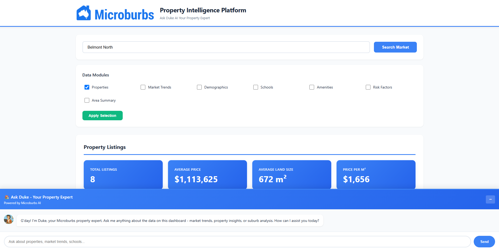
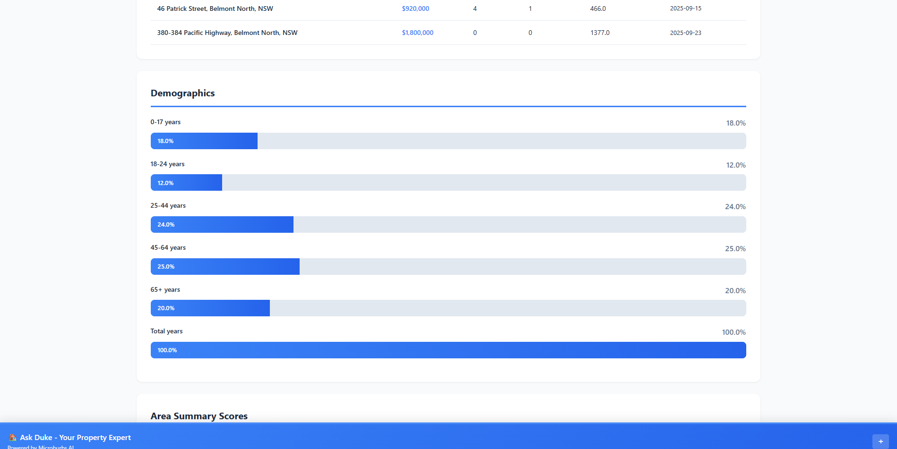
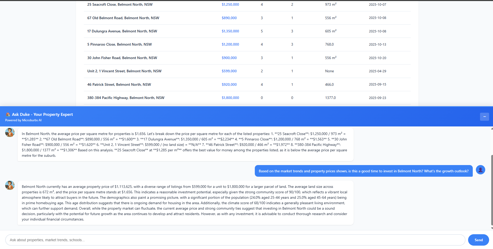

# Microburbs Professional Dashboard


A comprehensive real estate intelligence platform for the Australian property market. Built for Microburbs to analyze property data, market trends, demographics, schools, and local amenities across Australian suburbs.


## 📸 Screenshots

### Dashboard Overview


### Market Insights


### Duke AI Assistant



## 🏠 What is This?

**Microburbs Professional Dashboard** is a web-based analytics tool that provides:

- **Property Listings Analysis**: View and analyze current property listings with detailed metrics
- **Market Intelligence**: Track median prices, growth rates, and market trends over time
- **Demographics Data**: Understand population distribution and age demographics
- **School Information**: Access data on local public and private schools with NAPLAN rankings
- **Local Amenities**: Discover nearby facilities, parks, restaurants, and services
- **Risk Assessment**: Identify potential risk factors in specific areas
- **Area Summary Scores**: Get comprehensive suburb quality scores (lifestyle, community, convenience)
- **AI Assistant (Duke)**: Chat with an AI expert powered by OpenAI to ask questions about the data

## 🎯 Key Features

### 1. **Multi-Module Data Selection**
Select which data modules you want to see:
- Properties (with CSV export)
- Market Trends
- Demographics
- Schools
- Amenities
- Risk Factors
- Area Summary

### 2. **Interactive Data Tables**
- Sortable columns (click headers to sort)
- Real-time filtering
- Export to CSV functionality

### 3. **AI-Powered Chat Assistant**
Duke, your property expert, can answer questions like:
- "What's the average property price?"
- "Tell me about 25 Seacroft Close"
- "How many schools are nearby?"
- "Compare this suburb to regional prices"

### 4. **Visual Analytics**
- Insight cards with key metrics
- Demographic distribution charts
- Market trend analysis
- Color-coded area scores

## 🛠️ Technology Stack

**Backend:**
- Python 3.8+
- Flask 3.0.0 (Web framework)
- OpenAI API (GPT-4o-mini for chat)
- Requests (API calls)

**Frontend:**
- HTML5
- CSS3 (Custom styling)
- Vanilla JavaScript (No frameworks)

**APIs:**
- Microburbs API (Property data)
- OpenAI API (Chat functionality)

## 📋 Prerequisites

Before installation, ensure you have:

1. **Python 3.8 or higher**
   - Check: `python --version`
   - Download: [python.org](https://www.python.org/downloads/)

2. **pip** (Python package installer)
   - Usually comes with Python
   - Check: `pip --version`

3. **Git** (optional, for cloning)
   - Download: [git-scm.com](https://git-scm.com/)

4. **OpenAI API Key**
   - Create account: [platform.openai.com](https://platform.openai.com/)
   - Add $5-10 credit
   - Generate API key

## 📥 Installation Guide

### Step 1: Download/Clone the Project

**Option A: Download ZIP**
```bash
# Download the project ZIP file
# Extract to desired location
cd path/to/microburbs-dashboard
```

**Option B: Clone with Git**
```bash
git clone 
cd microburbs-dashboard
```

### Step 2: Create Virtual Environment

**Windows:**
```bash
python -m venv .venv
.venv\Scripts\activate
```

**macOS/Linux:**
```bash
python3 -m venv .venv
source .venv/bin/activate
```

You should see `(.venv)` in your terminal prompt.

### Step 3: Install Dependencies

```bash
pip install -r requirements.txt
```

This installs:
- Flask 3.0.0
- Requests 2.31.0
- OpenAI 1.54.3
- python-dotenv 1.0.0

### Step 4: Configure Environment Variables

Create a `.env` file in the project root:

```bash
# Windows
type nul > .env

# macOS/Linux
touch .env
```

Open `.env` and add:

```
OPENAI_API_KEY=your_openai_api_key_here
FLASK_SECRET_KEY=your_random_secret_key_here
```

**To generate a secret key:**
```bash
python -c "import secrets; print(secrets.token_hex(32))"
```

### Step 5: Add Your Logo (Optional)

Place your company logo as `logo.png` in the `static/` folder.

Recommended size: 200x60px (PNG format)

### Step 6: Run the Application

```bash
python app.py
```

You should see:
```
 * Running on http://127.0.0.1:5000
 * Debug mode: on
```

### Step 7: Open in Browser

Navigate to: **http://127.0.0.1:5000**

## 📁 Project Structure

```
microburbs-dashboard/
├── .env                      # Environment variables (DO NOT COMMIT)
├── .gitignore               # Git ignore file
├── .venv/                   # Virtual environment (DO NOT COMMIT)
├── app.py                   # Flask backend application
├── requirements.txt         # Python dependencies
├── README.md               # This file
├── static/                 # Static assets
│   ├── logo.png           # Company logo
│   ├── style.css          # Custom CSS styles
│   └── dashboard.js       # Frontend JavaScript
└── templates/             # HTML templates
    └── index.html         # Main dashboard page
```

## 🔑 API Keys Setup

### OpenAI API Key

1. **Create Account**
   - Go to [platform.openai.com](https://platform.openai.com/)
   - Sign up or log in

2. **Add Payment Method**
   - Go to Settings → Billing
   - Add payment method
   - Add $5-10 credit (should last months)

3. **Generate API Key**
   - Go to API Keys section
   - Click "Create new secret key"
   - Copy the key (starts with `sk-...`)
   - Paste in `.env` file

4. **Cost Estimate**
   - GPT-4o-mini: ~$0.15 per 1M tokens
   - Average query: ~$0.0001 per question
   - $5 = ~50,000 questions

### Microburbs API

The dashboard uses Microburbs sandbox API with the token `"Bearer test"`.

For production use:
- Contact Microburbs for production API access
- Update `API_TOKEN` in `app.py`

## 🚀 Usage Guide

### Basic Workflow

1. **Search for a Suburb**
   - Enter suburb name (e.g., "Belmont North")
   - Click "Search Market"

2. **Select Data Modules**
   - Check boxes for desired data
   - Click "Apply Selection"

3. **View Results**
   - Scroll through sections
   - Sort tables by clicking headers
   - Export data to CSV

4. **Ask Duke Questions**
   - Chat widget at bottom of page
   - Ask about any data shown
   - Get instant AI-powered insights

### Example Queries for Duke

**Property Questions:**
- "What's the average property price?"
- "Tell me about [specific address]"
- "Which property has the most bedrooms?"
- "Show me properties under $1M"

**Market Questions:**
- "What's the market growth rate?"
- "How does this compare to regional prices?"
- "What's the price trend over time?"

**General Questions:**
- "How many schools are nearby?"
- "What amenities are available?"
- "Tell me about the demographics"
- "What are the area scores?"

## 🎨 Customization

### Changing Colors

Edit `static/style.css`:

```css
:root {
    --primary: #3B82F6;        /* Main blue color */
    --primary-dark: #2563EB;   /* Darker blue */
    --secondary: #F8FAFC;      /* Light background */
    --success: #10B981;        /* Green for positive */
    --danger: #EF4444;         /* Red for negative */
}
```

### Changing AI Model

Edit `app.py`:

```python
response = client.chat.completions.create(
    model="gpt-4o-mini",  # Change to "gpt-4o" for better quality
    ...
)
```

Note: GPT-4o is more expensive (~$2.50/1M tokens vs $0.15/1M)

### Adding More Suburbs

The dashboard works with any Australian suburb. Just type the name!

## 🐛 Troubleshooting

### Issue: "Module not found" error

**Solution:**
```bash
# Ensure virtual environment is activated
# Windows
.venv\Scripts\activate

# Mac/Linux
source .venv/bin/activate

# Reinstall dependencies
pip install -r requirements.txt
```

### Issue: Chat not working / OpenAI error

**Solutions:**
1. Check `.env` file has correct API key
2. Verify API key is active on OpenAI dashboard
3. Check you have credits in OpenAI account
4. Look at terminal logs for specific error

### Issue: "Address already in use" (Port 5000 busy)

**Solution:**
```bash
# Option 1: Use different port
# Edit app.py, last line:
app.run(debug=True, port=5001)

# Option 2: Kill process on port 5000
# Windows
netstat -ano | findstr :5000
taskkill /PID  /F

# Mac/Linux
lsof -ti:5000 | xargs kill -9
```

### Issue: Dashboard loads but no data

**Solutions:**
1. Check internet connection
2. Verify Microburbs API is accessible
3. Check browser console (F12) for errors
4. Ensure suburb name is spelled correctly

### Issue: CSV export not working

**Solution:**
- Ensure you've loaded property data first
- Check browser allows file downloads
- Try different browser

## 🔒 Security Notes

### Important: Never Commit Secrets

The `.gitignore` file prevents committing:
- `.env` (contains API keys)
- `.venv/` (virtual environment)
- `__pycache__/` (Python cache)

### Before Sharing/Deploying

1. **Remove all API keys from code**
2. **Use environment variables only**
3. **Never share your `.env` file**
4. **Regenerate keys if accidentally exposed**

### Production Deployment

For production use:
1. Set `debug=False` in `app.py`
2. Use proper WSGI server (Gunicorn, uWSGI)
3. Use HTTPS
4. Set up proper authentication
5. Use production API keys

## 📊 Data Sources

- **Property Data**: Microburbs API
- **Demographics**: Australian Census data via Microburbs
- **Schools**: ACARA (Australian Curriculum, Assessment and Reporting Authority)
- **Market Trends**: Real estate transaction data
- **Area Scores**: Microburbs proprietary algorithms

## 🤝 Contributing

This is a private project for Microburbs. For questions or issues:

1. Check this README first
2. Review troubleshooting section
3. Check browser console (F12) for errors
4. Contact the development team

## 📝 License

Proprietary - Microburbs © 2025

## 🆘 Support

For technical support:
- Email: support@microburbs.com.au
- Documentation: [docs.microburbs.com.au](https://docs.microburbs.com.au)

## 🔄 Updates & Maintenance

### Updating Dependencies

```bash
pip install --upgrade -r requirements.txt
```

### Checking for Security Updates

```bash
pip list --outdated
```

## 📈 Performance Tips

1. **Minimize API calls**: Select only needed modules
2. **Use CSV export**: For offline analysis
3. **Chat wisely**: Each Duke query costs ~$0.0001
4. **Cache results**: Browser caches data for 5 minutes

## 🎓 Learning Resources

**Flask:**
- [Flask Documentation](https://flask.palletsprojects.com/)
- [Flask Mega-Tutorial](https://blog.miguelgrinberg.com/post/the-flask-mega-tutorial-part-i-hello-world)

**OpenAI API:**
- [OpenAI Documentation](https://platform.openai.com/docs)
- [API Reference](https://platform.openai.com/docs/api-reference)

**Python:**
- [Python.org](https://www.python.org/)
- [Real Python Tutorials](https://realpython.com/)

## 🏆 Credits

**Developed for Microburbs**
- Platform: Property Intelligence Dashboard
- AI Assistant: Duke (powered by OpenAI GPT-4o-mini)
- Data Provider: Microburbs API
- Year: 2025

---

**Version**: 1.0.0  
**Last Updated**: October 2025  
**Status**: ✅ Production Ready